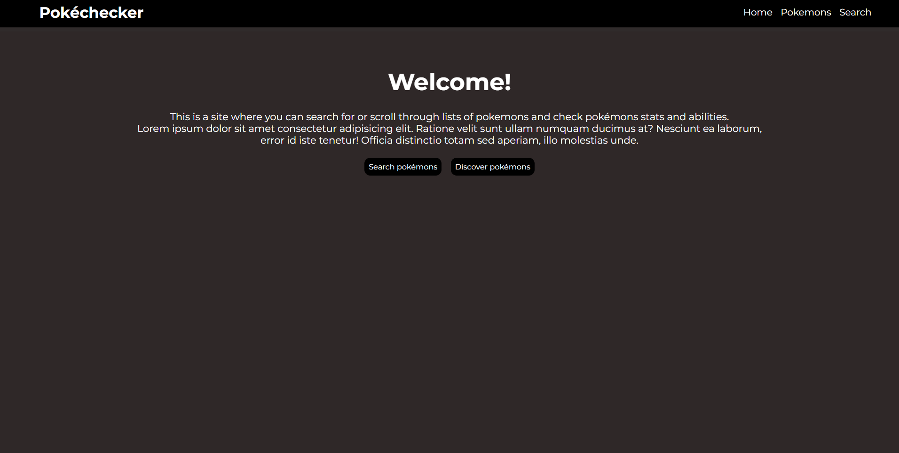
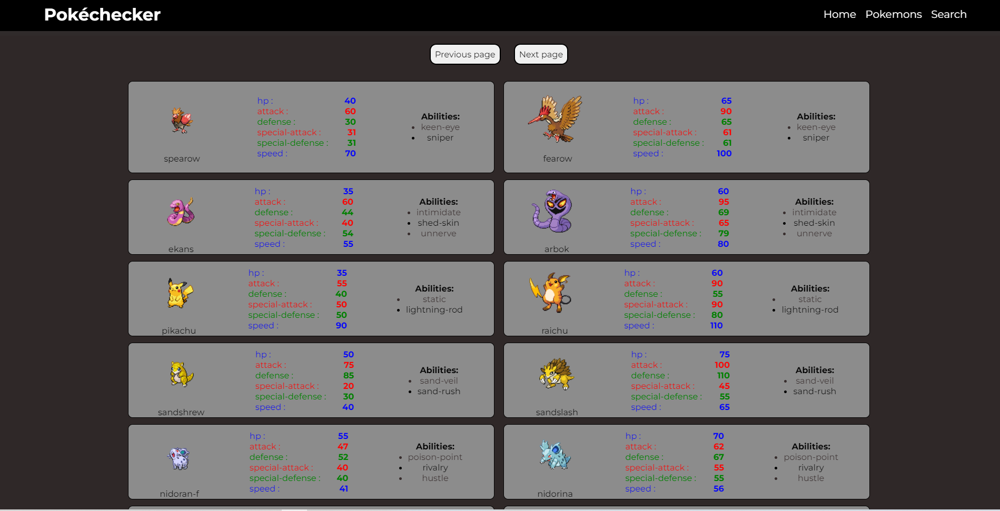

# React group project #
Created by Andreas and Shkelqim

We decided to make an application where the user is able to scroll through lists of pokémons or search for specific pokémons to see the stats and abilities that said pokémon possesses.

## Homepage ##
The *home*page is the first page that appears when the site is visited. Here, the page should display some information to the user about the page. 

## Pokemonlist ##
Another page that can be visited is the *Pokemons* page.
The *pokemons* page displays 20 pokémons per page.  
Here, the user can scroll through lists of pokémons to see every pokémons stats and abilities. 

## Search ##
We had plans of implementing a *search* page where the user would be able to search for specific pokémons that they would like to see. 
Implementing the pokemon page and having everything display the way we wanted took up too much of our time so we could not implement this (yet). 

This is something that we will keep working on and implement in the future.

